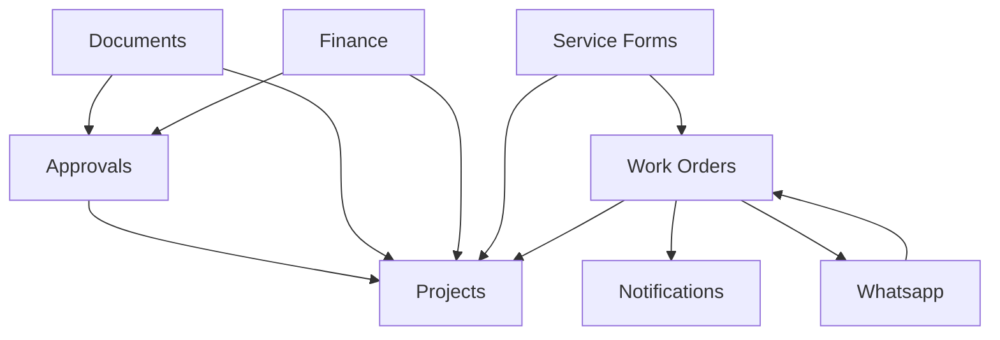

# GOLABS ERP — Domain Dependency Graph

Bu grafik `architecture/` JSON'larindaki `dependencies` tanimlarina gore uretilmistir.

```mermaid
graph TD;
    approvals["Approvals"];
    approvals --> projects;
    documents["Documents"];
    documents --> projects;
    documents --> approvals;
    finance["Finance"];
    finance --> projects;
    finance --> approvals;
    notifications["Notifications"];
    projects["Projects"];
    service_forms["Service Forms"];
    service_forms --> work_orders;
    service_forms --> projects;
    whatsapp["Whatsapp"];
    whatsapp --> work_orders;
    work_orders["Work Orders"];
    work_orders --> projects;
    work_orders --> notifications;
    work_orders --> whatsapp;
```
